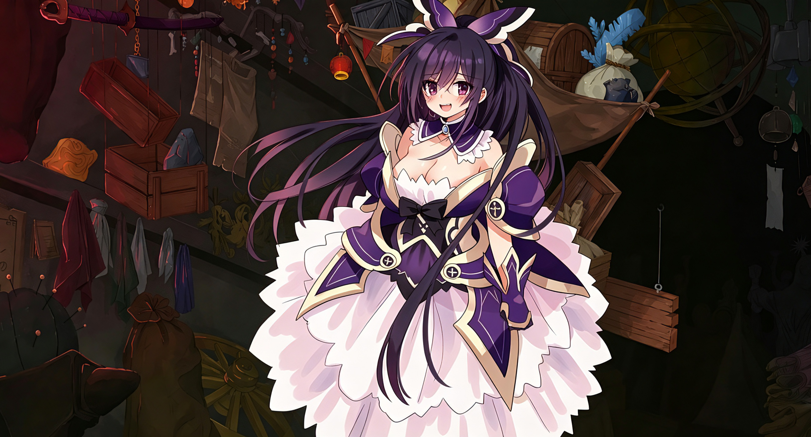
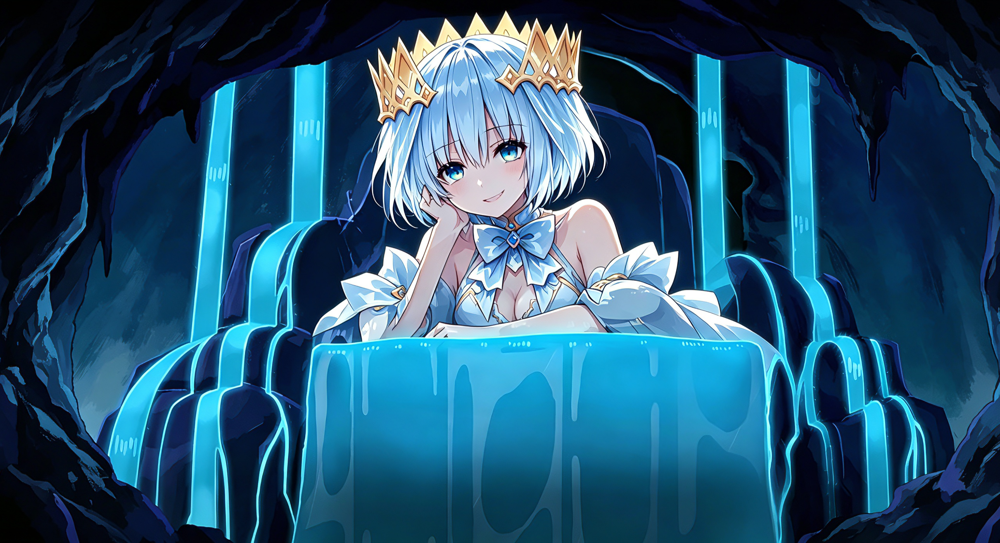
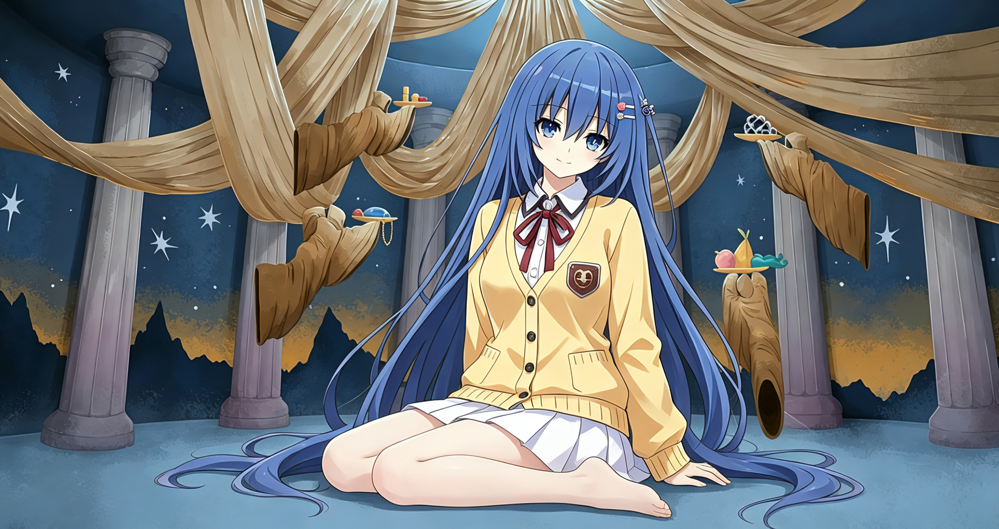
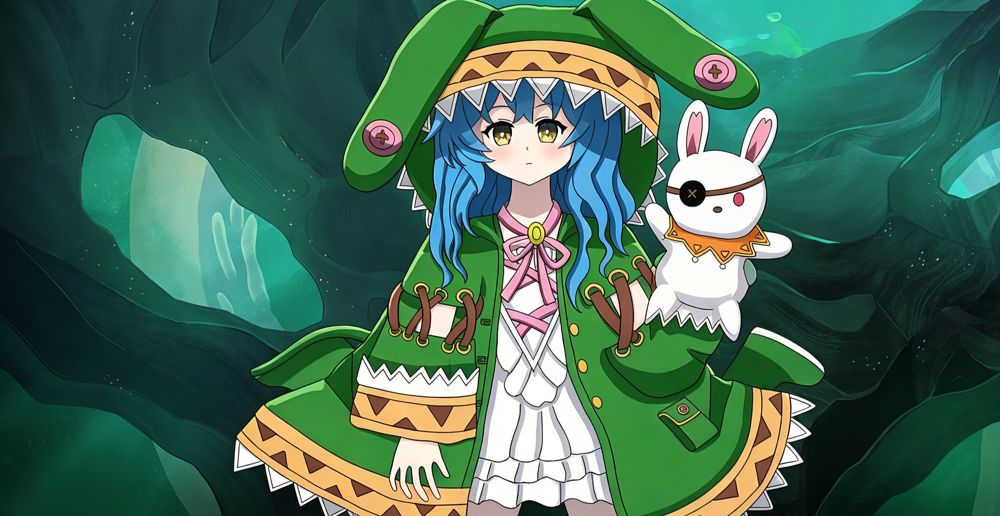
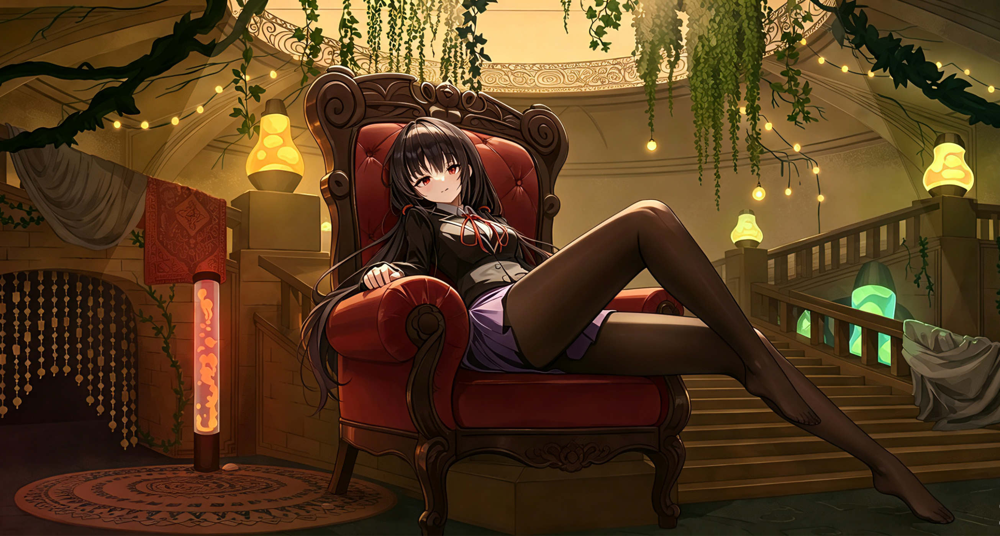
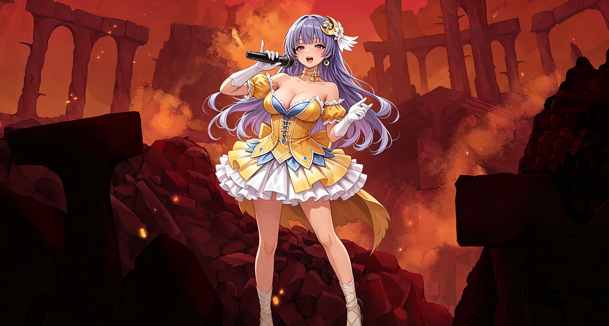
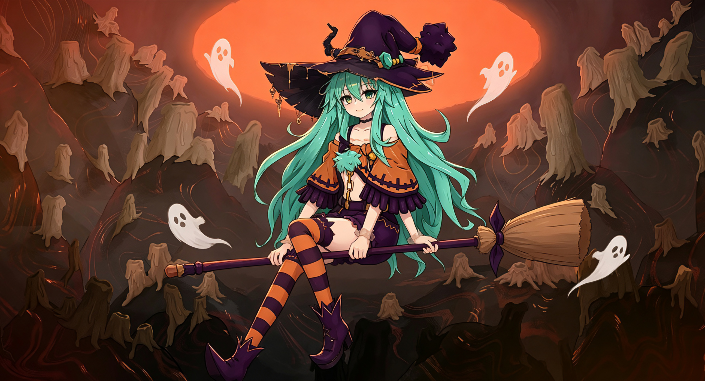
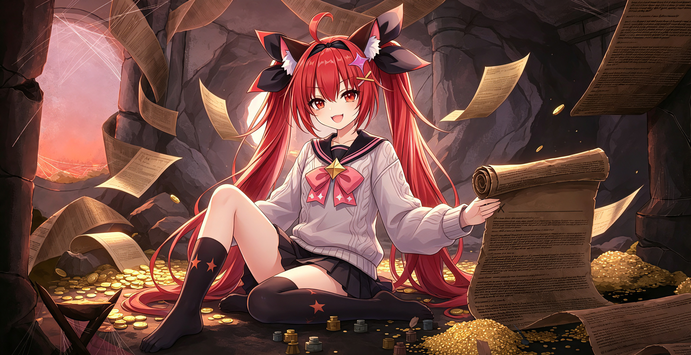

# Ancient Illustration Replacer

[Download latest mod zip](https://github.com/chocotea1008/STS2-Ancient-Illustration-Replacer/releases/latest/download/ancientillustrationreplacer-1.0.0.zip) | [Releases page](https://github.com/chocotea1008/STS2-Ancient-Illustration-Replacer/releases/latest)

Replaces the ancient event background illustrations with local PNG files.

The manifest keeps `affects_gameplay` set to `false`; this is a client-side visual replacement mod.

## Illustration Preview

| Darv | Neow |
| --- | --- |
|  |  |

| Nonupeipe | Orobas |
| --- | --- |
|  |  |

| Pael | Tanx |
| --- | --- |
|  |  |

| Tezcatara | Vakuu |
| --- | --- |
|  |  |

## Install

1. Download the latest release zip.
2. Extract the `ancientillustrationreplacer` folder into the Slay the Spire 2 `mods` folder.
3. Start the game with mods enabled.

Image files live in `images/` and are matched by ancient ID:

- `darv.png`
- `neow.png`
- `nonupeipe.png`
- `orobas.png`
- `pael.png`
- `tanx.png`
- `tezcatara.png`
- `vakuu.png`

## Build

When this source folder is under `Slay the Spire 2/_mod_sources`, run:

```powershell
powershell -ExecutionPolicy Bypass -File .\publish.ps1
```

If the repository is elsewhere, set the game directory first:

```powershell
$env:STS2_DIR = "D:\SteamLibrary\steamapps\common\Slay the Spire 2"
powershell -ExecutionPolicy Bypass -File .\publish.ps1
```
